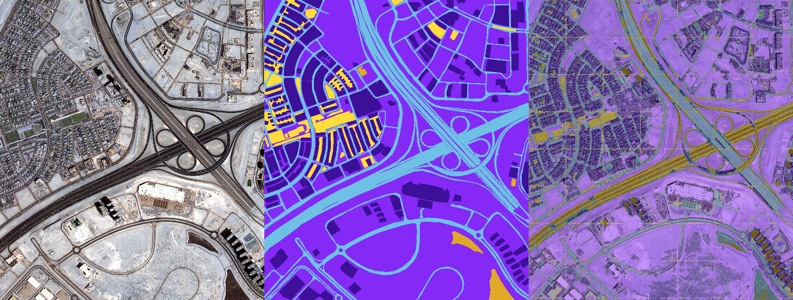

# Aerial Imagery Semantic Segmentation (U-Net)

Kaynak veri seti: [Semantic segmentation of aerial imagery](https://www.kaggle.com/datasets/humansintheloop/semantic-segmentation-of-aerial-imagery) (Dubai üzerinden çekilmiş uydu görüntüleri, 8 tile, 6 sınıf).

Bu proje, kurs videosundaki basit `load_dataset` fonksiyonunun üzerine kurulu,
daha temiz ve üretime yakın bir yapı sunar: modüler veri hazırlama (patchify +
RGB mask -> class-index dönüşümü), parametrik U-Net, eğitim/değerlendirme/
inference script'leri ve config dosyası.

## Kurulum

```bash
python3.14 -m venv .venv
source .venv/bin/activate
pip install -r requirements.txt
```

> Not: TensorFlow, Python 3.14'ü henüz desteklemiyor; bu yüzden proje PyTorch
> ile kuruldu. `torch`/`torchvision` bu ortamda zaten çalışıyor.

## Veri setini indirme

Veri seti bu repoya dahil değil (boyut ve lisans nedeniyle). Kurulum:

1. [Kaggle - Semantic segmentation of aerial imagery](https://www.kaggle.com/datasets/humansintheloop/semantic-segmentation-of-aerial-imagery) sayfasından indirin (Kaggle hesabı gerekir).
2. Arşivi proje kök dizinine, klasör adı **tam olarak** `Semantic segmentation dataset` olacak şekilde açın:

```
unet-aerial-imagery-segmentation/
└── Semantic segmentation dataset/
    ├── classes.json
    ├── Tile 1/{images,masks}/...
    ├── Tile 2/{images,masks}/...
    └── ... (Tile 8'e kadar)
```

## Veri seti hakkında önemli detaylar

- Görüntü boyutları tile'lara göre çok değişken (509x544 ile 2149x1479 arası).
  Bu yüzden sabit boyuta `resize` yerine **256x256 patch'lere bölme**
  (`src/data/patchify_dataset.py`) kullanılıyor.
- Maskeler **RGB renk kodlu** (grayscale değil). `classes.json`'daki hex
  renkler gerçek piksel değerleriyle örtüşmüyor; doğru eşleme
  `src/data/mask_utils.py` içinde ölçülmüş gerçek renklere göre tanımlı.
- Train/val/test bölünmesi **tile bazında** yapılır (`configs/default.yaml`
  içindeki `data.splits`), aynı görüntünün parçalarının hem train hem test'e
  sızmasını önlemek için.

## Kullanım

```bash
# U-Net mimarisini hızlıca doğrula (dummy input ile forward pass)
python src/models/unet.py

# Eğitim (ilk çalıştırmada patch cache otomatik oluşturulur -> outputs/patches/)
python src/train.py --config configs/default.yaml

# Test seti üzerinde IoU/Dice raporu + confusion matrix
python src/evaluate.py --config configs/default.yaml --checkpoint outputs/checkpoints/best_model.pt

# Tek bir görüntü üzerinde inference + renkli overlay
python src/predict.py \
  --image "Semantic segmentation dataset/Tile 1/images/image_part_001.jpg" \
  --checkpoint outputs/checkpoints/best_model.pt \
  --out outputs/predictions/tile1_part1_overlay.png
```

Tüm komutlar proje kök dizininden çalıştırılmalı.

## Örnek sonuç

8 epoch'luk kısa bir eğitim sonrası (CPU, ~15 dk) örnek tahmin — soldan sağa:
orijinal görüntü, gerçek maske, model tahmini (overlay):



Ana yol ağı ve büyük yapı blokları doğru yakalanıyor; küçük detaylar için
`configs/default.yaml`'daki 50 epoch'luk tam eğitim (early stopping ile)
gerekiyor.

## Dizin yapısı

```
configs/default.yaml       # tüm hiperparametreler (patch size, split, model, training)
src/data/mask_utils.py     # RGB <-> class-index mask dönüşümü
src/data/patchify_dataset.py  # ham tile verisinden patch cache üretimi
src/data/dataset.py        # torch Dataset + augmentation
src/models/unet.py         # parametrik U-Net
src/train.py               # eğitim döngüsü, checkpoint, early stopping
src/evaluate.py            # test seti metrikleri (IoU/Dice/pixel-acc)
src/predict.py             # tam görüntü üzerinde patch + stitch inference
src/utils/metrics.py       # confusion matrix tabanlı IoU/Dice hesaplama
src/utils/viz.py           # overlay ve grafik çizimleri
outputs/                   # patch cache, checkpoint, tahmin görselleri (git'e girmez)
```

## Sınıflar

| Index | Sınıf | Renk (RGB) |
|---|---|---|
| 0 | Building | (60, 16, 152) |
| 1 | Land (unpaved area) | (132, 41, 246) |
| 2 | Road | (110, 193, 228) |
| 3 | Vegetation | (254, 221, 58) |
| 4 | Water | (226, 169, 41) |
| 5 | Unlabeled | (155, 155, 155) |
